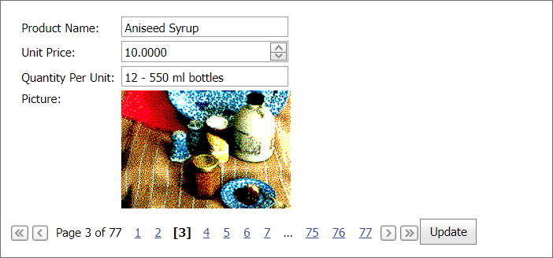

<!-- default badges list -->

<!-- default badges end -->
# Form Layout for ASP.NET Web Forms - How to edit database records

This example demonstrates how to edit database records in the [ASPxFormLayout](https://docs.devexpress.com/AspNet/14384/components/site-navigation-and-layout/form-layout) control's items.

> **Note**  
> In this example, the Form Layout control is bound to the Northwind sample database. Refer to the following topic for more information on how to load this database: [Get the sample databases for ADO.NET code samples](https://learn.microsoft.com/en-us/dotnet/framework/data/adonet/sql/linq/downloading-sample-databases).

In the example, the Form Layout control is bound to a data sorce record and contains multiple nested [DevExpress editors](https://docs.devexpress.com/AspNet/7897/components/data-editors). These editors allow you to edit the record's field values. Click the **Update** button to call the [SqlDataSource.Update](https://learn.microsoft.com/en-us/dotnet/api/system.web.ui.webcontrols.sqldatasource.update?view=netframework-4.8.1) method and save changes to the edited record. To navigate between records, use the [ASPxPager](https://docs.devexpress.com/AspNet/8288/components/data-and-image-navigation/pager?p=netframework) control.

## Files to Review

* [ImageHelper.cs](./CS/App_Code/ImageHelper.cs) (VB: [ImageHelper.vb](./VB/App_Code/ImageHelper.vb))
* [Default.aspx](./CS/Default.aspx) (VB: [Default.aspx](./VB/Default.aspx))
* [Default.aspx.cs](./CS/Default.aspx.cs) (VB: [Default.aspx.vb](./VB/Default.aspx.vb))

## Documentation

* [Bind Form Layout to Data](https://docs.devexpress.com/AspNet/15633/components/site-navigation-and-layout/form-layout/concepts/binding-to-data)
